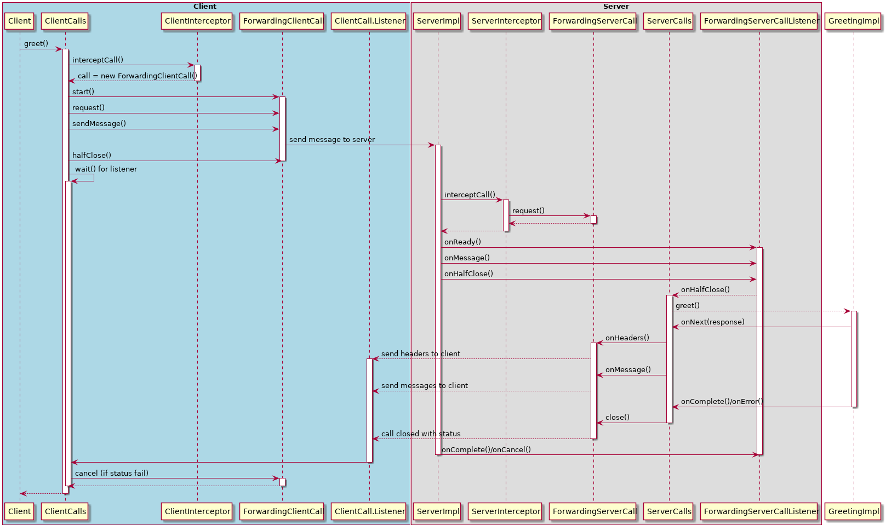

<div align="center">
    
</div>

## Getting Started

## Project structure
```
.
├── grpc-client
│   ...
├── grpc-server
│   ...
|
└── README.md
```

## Start services
### Start services in local

- Build & start grpc-server 
```shell script
$ cd grpc-server
$ ../mvnw clean package
$ ../mvnw spring-boot:run
...
```

- Build & start grpc-server  
```shell script
$ cd grpc-client
$ ../mvnw clean package
$ ../mvnw spring-boot:run
...
```

## Run testing

```shell script
curl http://localhost:8081/greet?name=World
```

## Illustrate Interceptor Flow

<div align="center">
    
</div>

## Contributing

The code is open sourced. I encourage fellow developers to contribute and help improve it!

- Fork it
- Create your feature branch (git checkout -b new-feature)
- Ensure all tests are passing
- Commit your changes (git commit -am 'Add some feature')
- Push to the branch (git push origin my-new-feature)
- Create new Pull Request

## Reference
- https://engineering.kabu.com/entry/2021/03/31/162401
## License
This project is licensed under the Apache License v2.0. Please see LICENSE.md located at the project's root for more details.